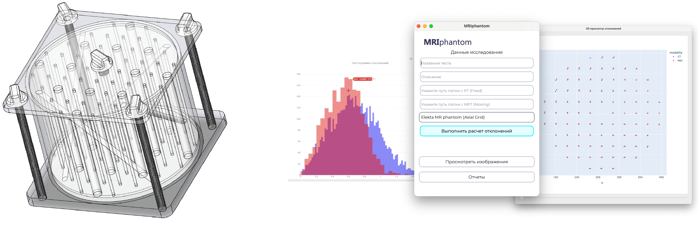

Документация программного обеспечения MRI QA Solution
==================================================

**MRIphantom QA Solution** -- программное обеспечение для автоматического анализа МРТ изображений для планирования радиохирургии.

.. note::
  Проект находится в разработке, поэтому к результатам анализа необходимо относиться с осторожностью.

.. toctree::
    user_guide/getting_started
    user_guide/user_interface
    user_guide/data_io
    user_guide/image_preprocessing
    user_guide/registration
    user_guide/segmentation
    user_guide/app_settings
    dev_guide/developer_guide

Indices and tables
==================

* :ref:`genindex`
* :ref:`modindex`
* :ref:`search`
